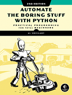

# Automating the Boring Stuff with Python

By Al Sweigart. Free to read online [here](https://automatetheboringstuff.com/). 

 A collection of mini projects found in Automating the Boring Stuff with Python.
 
 All coding done in Windows 10, **python 3.8.3**.
 
 To install the additional packages required, run:
*pip install -r requirements.txt*
## Chapter 3 - Functions
[collatz.py](https://github.com/mkoundo/Automate_the_Boring_Stuff/blob/master/chapter_3-Functions/collatz.py) - Write a function named collatz() that has one parameter named number. If number is even, then collatz() should print number // 2 and return this value. If number is odd, then collatz() should print and return  (3 * number) + 1.

## Chapter 4 - Lists
 [coin_flip.py](https://github.com/mkoundo/Automate_the_Boring_Stuff/blob/master/chapter_4-Lists/coin_flip.py) - For this exercise, we’ll try doing an experiment. If you flip a coin 100 times and write down an “H” for each heads and “T” for each tails, you’ll create a list that looks like “T T T T H H H H T T”. Write a program to find out how often a streak of six heads or a streak of six tails comes up in a randomly generated list of heads and tails. Your program breaks up the experiment into two parts: the first part generates a list of randomly selected 'heads' and 'tails' values, and the second part checks if there is a streak in it. Put all of this code in a loop that repeats the experiment 10,000 times so we can find out what percentage of the coin flips contains a streak of six heads or tails in a row. As a hint, the function call random.randint(0, 1) will return a 0 value 50% of the time and a 1 value the other 50% of the time.
 
[comma_code.py](https://github.com/mkoundo/Automate_the_Boring_Stuff/blob/master/chapter_4-Lists/comma_code.py) - Say you have a list value like this: spam = ['apples', 'bananas', 'tofu', 'cats'].
Write a function that takes a list value as an argument and returns a string with all the items
separated by a comma and a space, with and inserted before the last item. For example, passing
the previous spam list to the function would return 'apples, bananas, tofu, and cats'. But your
function should be able to work with any list value passed to it. Be sure to test the case where
an empty list [] is passed to your function.
## Chapter 5 - Dictionaries
[charactercount.py](https://github.com/mkoundo/Automate_the_Boring_Stuff/blob/master/chapter_5-Dictionaries/charactercount.py) - Here is a short program that counts the number of occurrences of each letter in a string.

[inventory.py](https://github.com/mkoundo/Automate_the_Boring_Stuff/blob/master/chapter_5-Dictionaries/inventory.py) - You are creating a fantasy video game. The data structure to model the player’s inventory will be a dictionary where the keys are string values describing the item in the inventory and the value is an integer value detailing how many of that item the player has. For example, the dictionary value {'rope': 1, 'torch': 6, 'gold coin': 42, 'dagger': 1, 'arrow': 12} means the player has 1 rope, 6 torches, 42 gold coins, and so on.

Write a function named displayInventory() that would take any possible “inventory” and display it like the following:
Inventory:
12 arrow
42 gold coin
1 rope
6 torch
1 dagger
Total number of items: 62

[nested_dictionary.py](https://github.com/mkoundo/Automate_the_Boring_Stuff/blob/master/chapter_5-Dictionaries/nested_dictionary.py) - Here’s a program that uses a dictionary that contains other dictionaries of what items guests are bringing to a picnic. The totalBrought() function can read this data structure and calculate the total number of an item being brought by all the guests.

[chess_validator.py](https://github.com/mkoundo/Automate_the_Boring_Stuff/blob/master/chapter_5-Dictionaries/chess_validator.py) - In this chapter, we used the dictionary value
{'1h': 'bking', '6c': 'wqueen', '2g': 'bbishop', '5h': 'bqueen', '3e': 'wking'}
to represent a chess board. Write a function named isValidChessBoard() that takes a dictionary argument and returns True or False depending on if the board is valid.

A valid board will have exactly one black king and exactly one white king. Each player can only have at most 16 pieces, at most 8 pawns, and all pieces must be on a valid space from '1a' to '8h'; that is, a piece can’t be on space '9z'. The piece names begin with either a 'w' or 'b' to represent white or black, followed by 'pawn',
'knight', 'bishop', 'rook', 'queen', or 'king'. This function should detect when a bug has resulted in an improper chess board.
## Chapter 6 - Strings
[mclip.py](https://github.com/mkoundo/Automate_the_Boring_Stuff/blob/master/chapter_6-Strings/mclip.py) - A program with a command line argument provides a short key phrase — for instance, agree or busy. The message associated with that key phrase will be copied to the clipboard so that the user can paste it into an email. This way, the user can have long, detailed messages without having to retype them.

[table_printer.py](https://github.com/mkoundo/Automate_the_Boring_Stuff/blob/master/chapter_6-Strings/table_printer.py) - Write a function named printTable() that takes a list of lists of strings and displays it in a well-organized table with each column right-justified. Assume that all the inner lists will contain the same number of strings.
## Chapter 7 - Regular Expressions
[date_detection.py](https://github.com/mkoundo/Automate_the_Boring_Stuff/blob/master/chapter_7-Regex/date_detection.py) - Write a regular expression that can detect dates in the DD/MM/YYYY format. Assume that the days range from 01 to 31, the months range from 01 to 12, and the years range from 1000 to 2999. Note that if the day or month is a single digit, it’ll have a leading zero. 

The regular expression doesn’t have to detect correct days for each month or for leap years; it will accept nonexistent dates like 31/02/2020 or 31/04/2021. Then store these strings into variables named month, day, and year, and write additional code that can detect if it is a valid date. April, June, September, and November have 30 days, February has 28 days, and the rest of the months have 31 days. February has 29 days in leap years. Leap years are every year evenly divisible by 4, except for years evenly divisible by 100, unless the year is also evenly divisible by 400. Note how this calculation makes it impossible to make a reasonably sized regular expression that can detect a valid date.

[regex_strip.py](https://github.com/mkoundo/Automate_the_Boring_Stuff/blob/master/chapter_7-Regex/regex_strip.py) - Write a function that takes a string and does the same thing as the strip() string method. If no other arguments are passed other than the string to strip, then whitespace characters will be removed from the beginning and end of the string. Otherwise, the characters specified in the second argument to the function will be removed from the string.

[strong_password.py](https://github.com/mkoundo/Automate_the_Boring_Stuff/blob/master/chapter_7-Regex/strong_password.py) - Write a function that uses regular expressions to make sure the password string it is passed is strong. A strong password is defined as one that is at least eight characters long, contains both uppercase and lowercase characters, and has at least one digit. You may need to test the string against multiple regex patterns to validate its strength.

[strong_password_advanced.py](https://github.com/mkoundo/Automate_the_Boring_Stuff/blob/master/chapter_7-Regex/strong_password_advanced.py) - Similar to [strong_password.py](https://github.com/mkoundo/Automate_the_Boring_Stuff/blob/master/chapter_7-Regex/strong_password.py) except uses regex lookaheads.
## Chapter 8 - Input Validation
[sandwich.py](https://github.com/mkoundo/Automate_the_Boring_Stuff/blob/master/chapter_8-Input_Validation/sandwich.py) - Write a program that asks users for their sandwich preferences. The program should use PyInputPlus to ensure that they enter valid input, such as:

Using inputMenu() for a bread type: wheat, white, or sourdough.
Using inputMenu() for a protein type: chicken, turkey, ham, or tofu.
Using inputYesNo() to ask if they want cheese.
If so, using inputMenu() to ask for a cheese type: cheddar, Swiss, or mozzarella.
Using inputYesNo() to ask if they want mayo, mustard, lettuce, or tomato.
Using inputInt() to ask how many sandwiches they want. Make sure this number is 1 or more.

Come up with prices for each of these options, and have your program display a total cost after the user enters their selection.
## Chapter 9 - Reading & Writing Files
[mcb.pyw](https://github.com/mkoundo/Automate_the_Boring_Stuff/blob/master/chapter_9-Files/mcb.pyw) - Let’s rewrite the “multi-clipboard” program from Chapter 6 so that it uses the shelve module. The user will now be able to save new strings to load to the clipboard without having to modify the source code. We’ll name this new program mcb.pyw (since “mcb” is shorter to type than “multi-clipboard”). The .pyw extension means that Python won’t show a Terminal window when it runs this program.

The program will save each piece of clipboard text under a keyword. For example, when you run python mcb.pyw --save spam, the current contents of the clipboard will be saved with the keyword spam. This text can later be loaded to the clipboard again by running py mcb.pyw spam. If the user forgets what keywords they have, they
can run python mcb.pyw --list to copy a list of all keywords to the clipboard.
Here’s what the program does:

The command line argument for the keyword is checked.
If the argument is --save, then the clipboard contents are saved to the keyword.
If the argument is --list, then all the keywords are copied to the clipboard.
Otherwise, the text for the keyword is copied to the clipboard.
This means the code will need to do the following:

Read the command line arguments from sys.argv.
Read and write to the clipboard.
Save and load to a shelf file.

> Usage:   
> python mcb.pyw --save <keyword> - Saves clipboard to shelf file with keyword.  
> python mcb.pyw \<keyword\> - Loads keyword from shelf to clipboard.  
> python mcb.pyw --list - Loads all keywords from shelf to clipboard.  
> python mcb.pyw --delete \<keyword\> - deletes keyword from shelf.  
> python mcb.pyw --delete - deletes all keywords from shelf.

[regex_search.py](https://github.com/mkoundo/Automate_the_Boring_Stuff/blob/master/chapter_9-Files/regex_search.py) - Write a program that opens all .txt files in a folder and searches for any line that matches a user-supplied regular expression. The results should be printed to the screen.

[mad_libs.py](https://github.com/mkoundo/Automate_the_Boring_Stuff/blob/master/chapter_9-Files/mad_libs.py) - Create a Mad Libs program that reads in text files and lets the user add their own text anywhere the word ADJECTIVE, NOUN, ADVERB, or VERB appears in the text file. For example, a text file may look like this:

>The ADJECTIVE panda walked to the NOUN and then VERB. A nearby NOUN was unaffected by these events.

The program would find these occurrences and prompt the user to replace them.
Enter an adjective:
silly
Enter a noun:
chandelier
Enter a verb:
screamed
Enter a noun:
pickup truck

The following text file would then be created:
>The silly panda walked to the chandelier and then screamed. A nearby pickup truck was unaffected by these events.

The results should be printed to the screen and saved to a new text file.
## Chapter 10 - Organising Files
[del_unneeded.py](https://github.com/mkoundo/Automate_the_Boring_Stuff/blob/master/chapter_10_Org_Files/del_unneeded.py) - It’s not uncommon for a few unneeded but humongous files or folders to take up the bulk of the space on your hard drive. If you’re trying to free up room on your computer, you’ll get the most bang for your buck by deleting the most massive of the unwanted files. But first you have to find them.
Write a program that walks through a folder tree and searches for exceptionally large files or folders—say, ones that have a file size of more than 100MB. (Remember that to get a file’s size, you can use os.path.getsize() from the os module.) Print these files with their absolute path to the screen.

[fill_gaps.py](https://github.com/mkoundo/Automate_the_Boring_Stuff/blob/master/chapter_10_Org_Files/fill_gaps.py) - Write a program that finds all files with a given prefix, such as spam001.txt, spam002.txt, and so on, in a single folder and locates any gaps in the numbering (such as if there is a spam001.txt and spam003.txt but no spam002.txt).
Have the program rename all the later files to close this gap.

As an added challenge, write another program that can insert gaps into numbered files so that a new file can be added.

[sel_copy.py](https://github.com/mkoundo/Automate_the_Boring_Stuff/blob/master/chapter_10_Org_Files/sel_copy.py) - Write a program that walks through a folder tree and searches for files with a certain file extension (such as .pdf or .jpg). Copy these files from whatever location they are in to a new folder.
## Chapter 11 - Debugging
[coin_toss.py](https://github.com/mkoundo/Automate_the_Boring_Stuff/blob/master/chapter_11_Debugging/coin_toss.py) - he following program is meant to be a simple coin toss guessing game. The player gets two guesses (it’s an easy game). However, the program has several bugs in it. Run through the program a few times to find the bugs that keep
the program from working correctly.
## Chapter 12 - Web Scraping
[2048.py](https://github.com/mkoundo/Automate_the_Boring_Stuff/blob/master/chapter_12_Web_Scraping/2048.py) - 2048 is a simple game where you combine tiles by sliding them up, down, left, or right with the arrow keys. You can actually get a fairly high score by repeatedly sliding in an up, right, down, and left pattern over and over
again. Write a program that will open the [2048 game](https://gabrielecirulli.github.io/2048/) and keep sending up, right, down, and left keystrokes to automatically play the game.

[cl_emailer.py](https://github.com/mkoundo/Automate_the_Boring_Stuff/blob/master/chapter_12_Web_Scraping/cl_emailer.py) - Write a program that takes an email address and string of text on the command line and then, using selenium, logs in to your email account and sends an email of the string to the provided address. (You might want to set up a
separate email account for this program.) This would be a nice way to add a notification feature to your programs. The webdriver used in this script is for Chrome and is available [here.](https://chromedriver.chromium.org/downloads)

[image_downloader.py](https://github.com/mkoundo/Automate_the_Boring_Stuff/blob/master/chapter_12_Web_Scraping/image_downloader.py) - Write a program that goes to a photo-sharing site like Flickr or Imgur, searches for a category of photos, and then downloads all the resulting images. You could write a program that works with any photo site that has a search feature.

[link_verification.py](https://github.com/mkoundo/Automate_the_Boring_Stuff/blob/master/chapter_12_Web_Scraping/link_verification.py) - Write a program that, given the URL of a web page, will attempt to download every linked page on the page. The program should flag any pages that have a 404 “Not Found” status code and print them out as broken links.
## Chapter 13 - Excel
[blank_row_inserter.py](https://github.com/mkoundo/Automate_the_Boring_Stuff/blob/master/chapter_13_Excel/blank_row_inserter.py) - Create a program blank_row_inserter.py that takes two integers and a filename string as command line arguments. Let’s call the first integer N and the second integer M. Starting at row N, the program should insert M blank rows into the spreadsheet. This solution takes advantage of the built-in insert_rows() method.

> usage: python blank_row_inserter.py row blank_rows file

[blank_row_inserter_forloop.py](https://github.com/mkoundo/Automate_the_Boring_Stuff/blob/master/chapter_13_Excel/blank_row_inserter_forloop.py) - Create a program blank_row_inserter.py that takes two integers and a filename string as command line arguments. Let’s call the first integer N and the second integer M. Starting at row N, the program should insert M blank rows into the spreadsheet.
You can write this program by reading in the contents of the spreadsheet. Then, when writing out the new spreadsheet,
use a for loop to copy the first N lines. For the remaining lines, add M to the row number in the output spreadsheet.

> usage: python blank_row_inserter_forloop.py row blank_rows file

[cell_inverter.py](https://github.com/mkoundo/Automate_the_Boring_Stuff/blob/master/chapter_13_Excel/cell_inverter.py) - Write a program to invert the row and column of the cells in the spreadsheet. For example, the value at row 5, column 3 will be at row 3, column 5 (and vice versa). This should be done for all cells in the spreadsheet.

[multiplication_table.py](https://github.com/mkoundo/Automate_the_Boring_Stuff/blob/master/chapter_13_Excel/multiplication_table.py) - Create a program multiplicationTable.py that takes a number N from the command line and creates an N×N multiplication table in an Excel spreadsheet. 

> usage: python multiplication_table.py n

[txt_2_xl.py](https://github.com/mkoundo/Automate_the_Boring_Stuff/blob/master/chapter_13_Excel/txt_2_xl.py) - Write a program to read in the contents of several text files (you can make the text files yourself) and insert those contents into a spreadsheet, with one line of text per row. The lines of the first text file will be in the cells of column A, the lines of the second text file will be in the cells of column B, and so on. Use the readlines() File object method to return a list of strings, one string per line in the file. For the first file, output the first line to column 1, row 1. The second line should be written to column 1, row 2, and so on. The next file that is read with readlines() will be written to column 2, the next file to column 3, and so on.

> usage: python txt_2_xl.py file1 file2 file3 ...

where filen are text files

[xl_2_txt.py](https://github.com/mkoundo/Automate_the_Boring_Stuff/blob/master/chapter_13_Excel/xl_2_txt.py) - Write a program that performs the tasks of txt_2_xl.py in reverse order: the program should open a spreadsheet and write the cells of column A into one text file, the cells of column B into another text file, and so on.

> usage: python xl_2_txt.py file

where file is in xlsx format
## Chapter 14 - Google Sheets
[bean_count.py](https://github.com/mkoundo/Automate_the_Boring_Stuff/blob/master/chapter_14_Google_Sheets/bean_count.py) - The columns of the first sheet in this [spreadsheet](https://docs.google.com/spreadsheets/d/1jDZEdvSIh4TmZxccyy0ZXrH-ELlrwq8_YYiZrEOB4jg/edit#gid=289119951) are “Beans per Jar,” “Jars,” and “Total Beans.” The “Total Beans” column is the product of the numbers in the “Beans per Jar” and “Jars” columns. However, there is a mistake in one of the 15,000 rows in this sheet. That’s too many rows to check by hand. Luckily, you can write a script that
checks the totals.

As a hint, you can access the individual cells in a row with ss[0].getRow(rowNum), where ss is the Spreadsheet object and rowNum is the row number. Remember that row numbers in Google Sheets begin at 1, not 0. The cell values will be strings, so you’ll need to convert them to integers so your program can work with them. The expression 
> int(ss[0].getRow(2)[0]) * int(ss[0].getRow(2)[1]) == int(ss[0].getRow(2)[2]) 

evaluates to True if the row has the correct total. Put this code in a loop to identify which row in the sheet has the incorrect total.

[convert_sheets.py](https://github.com/mkoundo/Automate_the_Boring_Stuff/blob/master/chapter_14_Google_Sheets/convert_sheets.py) - You can use Google Sheets to convert a spreadsheet file into other formats. Write a script that passes a submitted file to upload(). Once the spreadsheet has uploaded to Google Sheets, download it using downloadAsExcel(), downloadAsODS(), and other such functions to create a copy of the spreadsheet in these other formats.

> usage: convert_sheets.py file

[form_data.py](https://github.com/mkoundo/Automate_the_Boring_Stuff/blob/master/chapter_14_Google_Sheets/form_data.py) - Google Forms allows you to create simple online forms that make it easy to collect information from people. The information they enter into the form is stored in a Google Sheet. For this project, write a program that can
automatically download the form information that users have submitted. Go to [Google Forms](https://docs.google.com/forms/) and start a new form; it will be blank. Add fields to the form that ask the user for a name and email address. Then click the Send button in the upper right to get a link to your new form, such as [this](https://goo.gl/forms/QZsq5sC2Qe4fYO592/). Try to enter a few example responses into this form.

On the “Responses” tab of your form, click the green Create Spreadsheet button to create a Google Sheets spreadsheet that will hold the responses that users submit. You should see your example responses in the first rows of this spreadsheet. Then write a Python script using EZSheets to collect a list of the email addresses on this spreadsheet.
## Chapter 15 - PDF and DOCX 
[brute_force.py](https://github.com/mkoundo/Automate_the_Boring_Stuff/blob/master/chapter_15_PDF_DOCX/brute_force.py) - Brute force dictionary attack to decrypt a pdf file.

> usage: python brute_force.py dictionary file

[custom_invite.py](https://github.com/mkoundo/Automate_the_Boring_Stuff/blob/master/chapter_15_PDF_DOCX/custom_invite.py) - Write a program that would generate a Word document with custom invitations. Since Python-Docx can use only those styles that already exist in the Word document, you will have to first add these styles to a blank Word file and then open that file with Python-Docx. There should be one invitation per page in the resulting Word document, so call add_break() to add a page break after the last paragraph of each invitation. This way, you will need to open only one Word document to print all of the invitations at once.

> usage: python custom_invite.py template guestlist

[decrypt_pdf.py](https://github.com/mkoundo/Automate_the_Boring_Stuff/blob/master/chapter_15_PDF_DOCX/decrypt_pdf.py) - Write a program that finds all encrypted PDFs in a folder (and its subfolders) and creates a decrypted copy of the PDF using a provided password. If the password is incorrect, the program should print a message to the user and
continue to the next PDF.

> usage: python decrypt_pdf.py directory password

[encrypt_pdf.py](https://github.com/mkoundo/Automate_the_Boring_Stuff/blob/master/chapter_15_PDF_DOCX/encrypt_pdf.py) - Write a script that will go through every PDF in a folder (and its subfolders) and encrypt the PDFs using a password provided on the command line. Save each encrypted PDF with an _encrypted.pdf suffix added to the original filename. Before deleting the original file, have the program attempt to read and decrypt the file to ensure that it was encrypted correctly.

> usage: python encrypt_pdf.py directory password
## Chapter 16 - CSV and JSON
[getopenweather.py](https://github.com/mkoundo/Automate_the_Boring_Stuff/blob/master/chapter_16_CSV_JSON/getopenweather.py) - This program retrieves weather data from OpenWeatherMap.org for a given location and prints the current weather and forecast for the next two days.

> usage: python getopenweather.py city_name, 2-letter_country_code

[xl2csv.py](https://github.com/mkoundo/Automate_the_Boring_Stuff/blob/master/chapter_16_CSV_JSON/xl2csv.py) - Using the openpyxl module from Chapter 12, write a program that reads all the Excel files in the current working directory and outputs them as CSV files.

A single Excel file might contain multiple sheets; you’ll have to create one CSV file per sheet. The filenames of the CSV files should be \<excel filename\>_\<sheet title\>.csv, where \<excel filename\> is the filename of the Excel file without the file extension (for example, 'spam_data', not 'spam_data.xlsx') and \<sheet title\> is the string from the
Worksheet object’s title variable.
